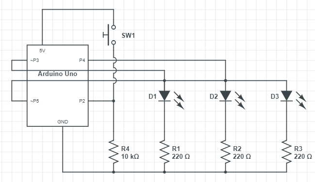

## Spaceship Interface - Arduino

### Schematic



### Demo

<a href="http://www.youtube.com/watch?feature=player_embedded&v=XCVt5tGuaa8
" target="_blank"></a>

XCVt5tGuaa8

### Code

```markdown


/*
One green LED (D1) symbolizing "system ready" remains lit until switch (SW1)
is depressed at which point two red LEDs (D2&D3) alternate turning on and off
every 250ms symbolizing "engage hyperdrive" while the switch remains depressed.
*/

int switchState = 0; //initialized to off

void setup() {

  pinMode(3,OUTPUT); //D1
  pinMode(4,OUTPUT); //D2
  pinMode(5,OUTPUT); //D3
  pinMode(2,INPUT); //SW1
}

void loop() {

  switchState = digitalRead(2); //get SW1 state
  //HIGH is on and LOW is off
  if ( switchState == LOW ) {
    digitalWrite(3, HIGH);
    digitalWrite(4, LOW);
    digitalWrite(5, LOW);

    } else {
    digitalWrite(3, LOW);
    digitalWrite(4, LOW);
    digitalWrite(5, HIGH);
    
    delay(250);
    digitalWrite(4, HIGH);
    digitalWrite(5, LOW);
    delay(250);
    }
}
```

For more details see [GitHub Flavored Markdown](https://guides.github.com/features/mastering-markdown/).

### Jekyll Themes

Your Pages site will use the layout and styles from the Jekyll theme you have selected in your [repository settings](https://github.com/cmhenwood/cmhenwood.github.io/settings). The name of this theme is saved in the Jekyll `_config.yml` configuration file.

### Support or Contact

Having trouble with Pages? Check out our [documentation](https://help.github.com/categories/github-pages-basics/) or [contact support](https://github.com/contact) and we’ll help you sort it out.

<a href="http://www.youtube.com/watch?feature=player_embedded&v=lojidoW1azU
" target="_blank"></a>

<a href="http://www.youtube.com/watch?feature=player_embedded&v=_uJQshS_Upg
" target="_blank"></a>
