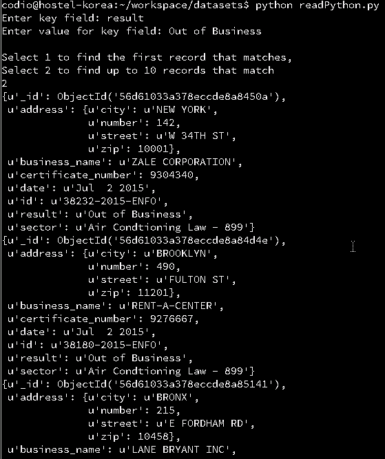
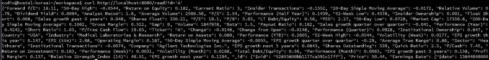

[< Back to index](index.md)

## MongoDB

This project highlights work with MongoDB, a non-relational database. Specfically Python scripting is used to provide an interface for a user to perform basic database functions without requiring them to have knowledge of MongoDB or Mongod syntax.

### Python Code
```Python
import json
import pprint
from bson import json_util
from pymongo import MongoClient

connection = MongoClient('localhost', 27017)
db = connection['city']
collection = db['inspections']

def read():
    try:
        userKey = raw_input('Enter key field: ')
        userValue = raw_input('Enter value for key field: ')
        oneOrMany = raw_input('\nSelect 1 to find the first record that matches, \nSelect 2 to find up to 10 records that match\n')
    
    except ValidationError as ve:
        abort(400, str(ve))
        
    try:
        if oneOrMany == '1':
            pprint.pprint(collection.find_one({ userKey : userValue}))
        elif oneOrMany == '2':
            return10 = collection.find({userKey : userValue}).limit(10)

            for document in return10:
                pprint.pprint(document)
    
    except ValidationError as ve:
        abort(400, str(ve))

def main():
    read()
    
main()
```
### Sample Output


### RESTful API
Here is code with similar functionality to the scripting above but utilizing the RESTful standard. This essentially takes the query from the user and calls a script similar to above to find and display the requested information.

```Python
#!/usr/bin/python

import json
from bson import json_util
import bottle
from bottle import route, run, request, abort
from pymongo import MongoClient

connection = MongoClient('localhost', 27017)
db = connection['market']
collection = db['stocks']


def get_document(key, value):
  print key
  print value
  document = collection.find_one({key:value}) #find matching document
  if not document: #if no match is found
    abort(404, 'No document with %s : %s' % key, value)
  return document #return matching document

@route('/read', method = 'GET')
def read():
  print request.query.id
  entity = get_document("Ticker", request.query.id) #send key and user requested ticker to get function
  if not entity: #check for valid response
    abort(404, 'No document with ticker %s' % request.query.id)
  return json.loads(json.dumps(entity, indent = 4, default = json_util.default)) #return matching document


run(host = '0.0.0.0', port = 8080)
```
### Sample Output


[< Back to index](index.md)
